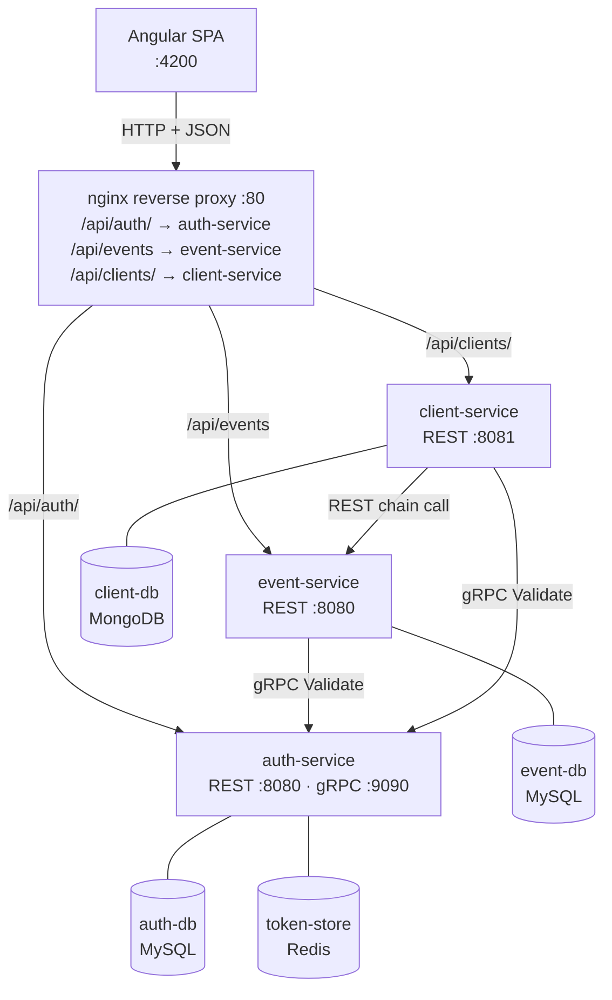
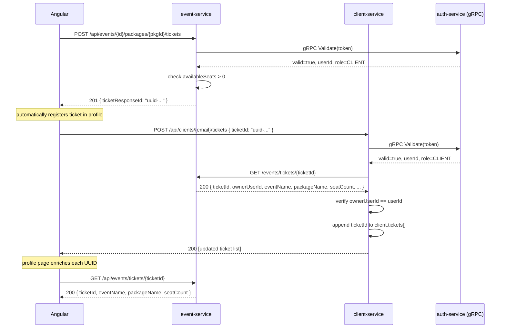
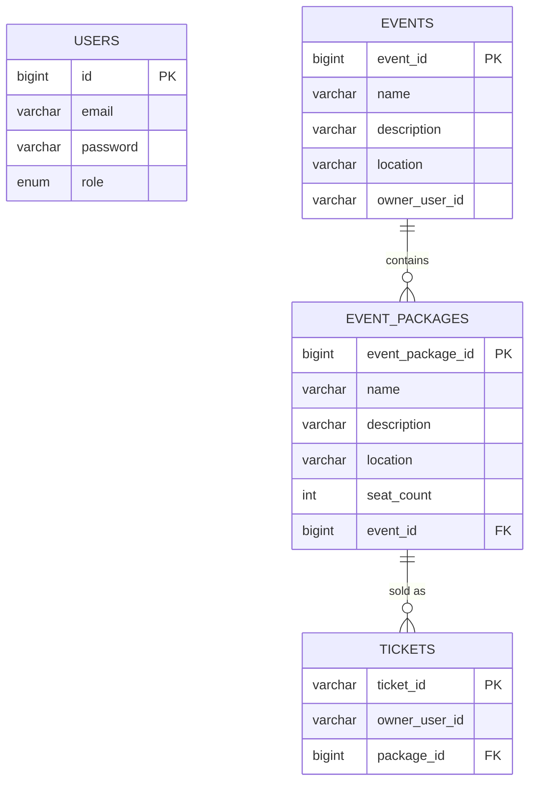

# Event Platform

A microservices-based platform for managing artistic events, ticket packages, and client bookings.

---

## Table of Contents

- [Core Functionality](#core-functionality)
- [Architecture](#architecture)
- [Ticket Purchase Flow](#ticket-purchase-flow)
- [Entity-Relationship Model](#entity-relationship-model)
- [Security Model](#security-model)
- [JWT Token Structure](#jwt-token-structure)
- [gRPC Contract](#grpc-contract)
- [REST API — Auth Service](#rest-api--auth-service)
- [REST API — Event Service](#rest-api--event-service)
- [REST API — Client Service](#rest-api--client-service)
- [Key Design Decisions](#key-design-decisions)
- [Database Schemas](#database-schemas)
- [Project Structure](#project-structure)
- [Environment Variables](#environment-variables)
- [Running with Docker](#running-with-docker)
- [Local Development](#local-development)
- [Default Admin Account](#default-admin-account)

---

## Core Functionality

**Event Management**: Users with the `OWNER_EVENT` role create and manage artistic events. Each event has a name, optional location, and description. Owners can define one or more ticket packages per event in a single operation, each with a fixed seat count. Only the event owner can modify or delete their own events and packages. Admins have unrestricted access. Event browsing is public — no account is required to list or view events.

**Ticket Sales**: Clients browse public event and package listings and purchase tickets for any package with available seats. The system tracks sold tickets in real time and blocks purchases when a package reaches capacity. Each ticket is identified by a UUID generated at purchase time. Immediately after purchase, the Angular client automatically registers the UUID in the client profile — no manual step required.

**Client Profiles**: Clients maintain a personal profile stored in MongoDB with optional public information and social media links. The profile page displays each registered ticket enriched with the event name, package name, and seat count — resolved live from the event-service. The client-service validates ticket ownership via a chain call to the event-service before persisting any UUID.

**Account Administration**: Anyone can self-register a `CLIENT` account from the profile page (`/profile`) — no dedicated registration page exists. The `ADMIN` role manages access levels from `/manage-user`: instead of creating accounts from scratch, an admin looks up an existing user by email and changes their role between `CLIENT` and `OWNER_EVENT`. Admins also have unrestricted CRUD access to all events, packages, and user roles, but do not interact with client profile data.

---

## Architecture



### Services

| Service | Role | Stack | Port |
|---------|------|-------|------|
| auth-service | Identity management — JWT issuance, validation, blacklist | Spring Boot, MySQL, Redis, gRPC | REST :8080, gRPC :9090 |
| event-service | Events, packages, tickets | Spring Boot, MySQL, Spring HATEOAS | REST :8080 |
| client-service | Client profiles and ticket history | Spring Boot, MongoDB | REST :8081 |
| frontend | Single Page Application | Angular 22, nginx | :80 (→ host :4200) |

### nginx Proxy Rules

| Location prefix | Proxied to | Notes |
|-----------------|-----------|-------|
| `/api/auth/` | `http://auth-service:8080/auth/` | Trailing slash preserved |
| `/api/events` | `http://event-service:8080/events` | Prefix match, no trailing slash |
| `/api/clients/` | `http://client-service:8081/clients/` | Trailing slash preserved |

The `GET /events/tickets/{ticketId}` endpoint is reachable both within the Docker network (used by client-service for chain validation) and externally via `/api/events/tickets/{ticketId}` (used by the Angular frontend to enrich ticket display in the profile page), because the `location /api/events` prefix rule in nginx matches all paths under that prefix.

---

## Ticket Purchase Flow



The chain call from client-service to event-service ensures the ticket UUID exists and belongs to the authenticated user before it is stored in MongoDB. The same `GET /events/tickets/{ticketId}` endpoint is also called by the Angular frontend to display human-readable ticket info (event name, package name, seat count) in the profile page.

---

## Entity-Relationship Model



`owner_user_id` in `EVENTS` and `TICKETS` stores the JWT `sub` claim as a plain string — there is no foreign key to `USERS`. The services run on separate databases and do not share a schema.

---

## Security Model

### Roles and Permissions

| Role | Capabilities |
|------|-------------|
| `ADMIN` | Change any user's role (`CLIENT` ↔ `OWNER_EVENT`); full CRUD on all events and packages regardless of owner |
| `OWNER_EVENT` | Full CRUD on own events and packages; read-only on events owned by others |
| `CLIENT` | Purchase tickets; view events and packages; manage own profile |

### Authorization Flow

```
HTTP Request + Authorization: Bearer <token>
         │
         ▼
Extract token from Authorization header
         │
         ▼
gRPC Validate(token) → auth-service
         │
         ├── valid=false → 401 Unauthorized
         │
         └── valid=true → { userId, role }
                  │
                  ├── role insufficient → 403 Forbidden
                  │
                  └── authorized → process request
```

Read endpoints for events and packages (`GET /events`, `GET /events/{id}`, `GET /events/{id}/packages`, `GET /events/{id}/packages/{packageId}`) are **public** — no token required. Self-registration (from the `/profile` page) is also publicly accessible and always creates a `CLIENT` account; promoting a user to `OWNER_EVENT` requires an `ADMIN` to change their role from `/manage-user`.

---

## JWT Token Structure

Tokens follow the **JWS** standard (RFC 7515/7519): `base64url(header).base64url(payload).signature`

### Header
```json
{ "alg": "HS256", "typ": "JWT" }
```

### Payload (Claims)

| Claim | Type | Description |
|-------|------|-------------|
| `sub` | string | User ID — numeric ID stored as string |
| `role` | string | `ADMIN`, `OWNER_EVENT`, or `CLIENT` |
| `iat` | number | Issued-at timestamp |
| `exp` | number | Expiration timestamp (default: 24 h) |

### Signature

```
HMAC-SHA256(base64url(header) + "." + base64url(payload), secretKey)
```

The secret key is configured via `JWT_SECRET` as a 64-character hex string (256-bit).

### Token Blacklist

A JWT is self-contained: any service holding the secret can verify it offline, which is what makes stateless validation cheap. The flip side is that nothing can *un-issue* a token — it stays valid until its `exp` passes. Logout therefore needs a small piece of shared state recording which not-yet-expired tokens have been revoked.

On logout, auth-service writes that record to Redis (`token-store`):

```java
long ttl = jwtService.getExpiration(token) - System.currentTimeMillis();
redis.opsForValue().set("bl:" + sha256(token), "1", Duration.ofMillis(ttl));
```

Every `Validate` gRPC call checks the key before verifying the signature. Three properties follow from the design, and each one is the reason for a specific choice:

**TTL equal to the token's remaining lifetime.** A revoked token only needs to be remembered until the moment it would have expired on its own — after that, signature verification rejects it anyway and the blacklist entry is dead weight. Letting Redis expire the key makes the store self-limiting: it holds at most the tokens revoked within one `jwt.expiration-ms` window, never grows monotonically, and needs no cleanup job, no `@Scheduled` sweep, and no eviction policy.

**External to the JVM, not a field on a bean.** This is the property that actually matters here. An in-process `Set` would fail open in two ways that only appear in the deployment this project is built around: a logged-out but not-yet-expired token becomes valid again the moment auth-service restarts, and a logout served by one replica is invisible to every other replica. Both are silent — nothing errors, the token is simply accepted again. Redis is shared by all instances and survives restarts, so revocation is a property of the system rather than of one process's heap.

**Key is a SHA-256 hash, not the token.** Bearer tokens are credentials; hashing keeps them out of the store in plaintext, and gives fixed-length keys instead of ~250 variable bytes. The lookup is still an exact match, so nothing is lost.

Expiry itself is *not* handled here — `JwtService.isValid()` checks it independently when parsing the signature. The blacklist covers only the window between an explicit logout and natural expiry; the two mechanisms are deliberately separate.

The trade-off is that auth-service now depends on Redis being reachable: if `token-store` is down, `validate` fails rather than silently degrading. That is intentional — the two possible fallbacks are "treat as not blacklisted", which reintroduces exactly the fail-open behaviour above, and "treat as blacklisted", which logs out every user.

The second cost is that validation is no longer a purely local operation: every validated request now pays one Redis round-trip, which is the property JWTs are normally chosen to avoid. That is the price of a 24-hour token lifetime — with short-lived access tokens (5–15 min) plus refresh tokens, revocation would be handled when a token is refreshed and the per-request lookup could be dropped entirely. That is the natural next step; it is not implemented here.

---

## gRPC Contract

Defined in `auth.proto` — identical copy in all services under `src/main/proto/`.

```protobuf
syntax = "proto3";
package auth;

option java_package = "com.example.auth.grpc";

service AuthService {
  rpc Validate (ValidateRequest) returns (ValidateResponse);
  rpc Logout   (LogoutRequest)   returns (LogoutResponse);
}

message ValidateRequest  { string token   = 1; }
message ValidateResponse { bool valid     = 1; string user_id = 2; string role = 3; }

message LogoutRequest  { string token   = 1; }
message LogoutResponse { bool   success = 1; }
```

All RPCs use the **Unary RPC** pattern. event-service and client-service connect to auth-service via `ManagedChannelBuilder.forAddress(AUTH_GRPC_HOST, AUTH_GRPC_PORT).usePlaintext()`.

---

## REST API — Auth Service

Base path: `/auth` · External: `/api/auth/` · Port: `8080` (internal), `8090` (host debug)

| Method | Path | Auth | Status | Description |
|--------|------|------|--------|-------------|
| `POST` | `/auth/login` | Public | 200, 401 | Authenticate, receive JWT |
| `POST` | `/auth/logout` | Bearer | 200 | Invalidate token (add to blacklist) |
| `POST` | `/auth/register` | Public | 201, 409 | Self-register a `CLIENT` account, receive JWT |
| `PATCH` | `/auth/users/role` | ADMIN | 200, 400, 403 | Change an existing user's role |

### POST `/auth/login`

```json
// Request
{ "email": "owner@platform.com", "password": "secret123" }

// 200
{ "token": "eyJhbGciOiJIUzI1NiJ9..." }

// 401
{ "error": "Credentiale invalide" }
```

### POST `/auth/logout`

```
Authorization: Bearer <token>
```

```json
// 200
{ "success": true }
```

### POST `/auth/register`

```json
// Request
{ "email": "client@platform.com", "password": "pass123" }

// 201
{ "token": "eyJhbGciOiJIUzI1NiJ9..." }

// 409
{ "error": "Email deja existent" }
```

The new account is always created with role `CLIENT`. There is no public endpoint to self-register as `OWNER_EVENT` or `ADMIN` — an admin must promote the account afterwards via `PATCH /auth/users/role`.

### PATCH `/auth/users/role`

```json
// Request (ADMIN token required)
{ "email": "client@platform.com", "role": "OWNER_EVENT" }

// 200
{ "message": "Rol actualizat cu succes" }

// 400
{ "error": "Utilizator inexistent" }

// 403
{ "error": "Acces interzis" }
```

Assignable roles from the admin UI: `OWNER_EVENT`, `CLIENT`. The endpoint itself accepts any value of the `Role` enum (`ADMIN`, `OWNER_EVENT`, `CLIENT`), but the frontend only exposes the two non-admin roles to avoid accidental admin escalation through the UI.

---

## REST API — Event Service

Base path: `/events` · External: `/api/events` · Port: `8080`

All responses include HATEOAS `_links`. `GET` endpoints are public. Write endpoints require `Authorization: Bearer <token>`.

List endpoints (`GET /events`, `GET /events/{eventId}/packages`, `GET /events/{eventId}/packages/{packageId}/tickets`) return a HAL collection instead of a bare array, so the individual items keep their own `_links`:

```json
{
  "_embedded": {
    "events": [
      { "eventResponseId": 1, "name": "Concert Iași", "_links": { "self": { "href": "/events/1" } } }
    ]
  }
}
```

The Angular `HateoasService.unwrapCollection()` transparently extracts the array from `_embedded` (or passes a bare array through), so consumers of `EventService` still work with plain `T[]`.

### Events

| Method | Path | Auth | Status | Description |
|--------|------|------|--------|-------------|
| `GET` | `/events` | Public | 200 | List events (paginated, filterable) |
| `GET` | `/events/{id}` | Public | 200, 404 | Get event by ID |
| `POST` | `/events` | OWNER_EVENT or ADMIN | 201, 401, 403 | Create event |
| `PUT` | `/events/{id}` | OWNER_EVENT (own) or ADMIN | 200, 401, 403, 404 | Replace event |
| `DELETE` | `/events/{id}` | OWNER_EVENT (own) or ADMIN | 204, 401, 403, 404 | Delete event and all its packages and tickets |

#### Query parameters — `GET /events`

| Parameter | Type | Default | Description |
|-----------|------|---------|-------------|
| `name` | string | — | Partial, case-insensitive name filter |
| `page` | int | `0` | Page index (0-based) |
| `size` | int | `10` | Items per page |

Results are sorted alphabetically by name.

#### Event body (`POST`, `PUT`)

```json
{ "name": "Concert Iași", "location": "Sala Palatului", "description": "Un concert extraordinar" }
```

`name` is required. `location` and `description` are optional.

#### Event response

```json
{
  "eventResponseId": 1,
  "name": "Concert Iași",
  "location": "Sala Palatului",
  "description": "Un concert extraordinar",
  "_links": {
    "self":     { "href": "/events/1" },
    "packages": { "href": "/events/1/packages" }
  }
}
```

`ownerUserId` is stored server-side and never exposed in responses.

---

### Packages

| Method | Path | Auth | Status | Description |
|--------|------|------|--------|-------------|
| `GET` | `/events/{eventId}/packages` | Public | 200, 404 | List packages for an event |
| `GET` | `/events/{eventId}/packages/{packageId}` | Public | 200, 404 | Get package by ID |
| `POST` | `/events/{eventId}/packages` | OWNER_EVENT (own event) or ADMIN | 201, 401, 403, 404 | Create package |
| `PUT` | `/events/{eventId}/packages/{packageId}` | OWNER_EVENT (own event) or ADMIN | 200, 401, 403, 404 | Replace package |
| `DELETE` | `/events/{eventId}/packages/{packageId}` | OWNER_EVENT (own event) or ADMIN | 204, 401, 403, 404 | Delete package and all its tickets |

#### Package body (`POST`, `PUT`)

```json
{ "name": "VIP", "location": "Zona A", "description": "Acces VIP", "seatCount": 50 }
```

`name` and `seatCount` are required (`seatCount` ≥ 1). `location` and `description` are optional.

#### Package response

```json
{
  "packageResponseId": 3,
  "name": "VIP",
  "location": "Zona A",
  "description": "Acces VIP",
  "seatCount": 50,
  "availableSeats": 47,
  "_links": {
    "self":    { "href": "/events/1/packages/3" },
    "event":   { "href": "/events/1" },
    "tickets": { "href": "/events/1/packages/3/tickets" }
  }
}
```

`availableSeats` is computed dynamically as `seatCount − COUNT(tickets)`.

---

### Tickets

| Method | Path | Auth | Status | Description |
|--------|------|------|--------|-------------|
| `GET` | `/events/{eventId}/packages/{packageId}/tickets` | OWNER_EVENT (own) or ADMIN | 200, 401, 403, 404 | List all tickets for a package |
| `POST` | `/events/{eventId}/packages/{packageId}/tickets` | CLIENT | 201, 401, 403, 404, 409 | Purchase a ticket |
| `GET` | `/events/{eventId}/packages/{packageId}/tickets/{ticketId}` | CLIENT (own), OWNER_EVENT (own), or ADMIN | 200, 401, 403, 404 | Get ticket by ID (HATEOAS) |
| `GET` | `/events/tickets/{ticketId}` | Public (internal + frontend) | 200, 404 | Ticket detail lookup — used by client-service chain call and Angular profile page |

#### Ticket response — `GET /events/{eventId}/packages/{packageId}/tickets/{ticketId}`

```json
{
  "ticketResponseId": "f47ac10b-58cc-4372-a567-0e02b2c3d479",
  "ownerUserId": "42",
  "_links": {
    "self":    { "href": "/events/1/packages/3/tickets/f47ac10b-58cc-4372-a567-0e02b2c3d479" },
    "package": { "href": "/events/1/packages/3" }
  }
}
```

`409 Conflict` is returned when all seats are sold. A CLIENT can view only their own ticket; an OWNER_EVENT can view any ticket for packages on their own event.

#### Ticket detail response — `GET /events/tickets/{ticketId}`

```json
{
  "ticketId": "f47ac10b-58cc-4372-a567-0e02b2c3d479",
  "ownerUserId": "42",
  "eventId": 1,
  "eventName": "Concert Iași",
  "packageId": 3,
  "packageName": "VIP",
  "seatCount": 50
}
```

This endpoint resolves the ticket → package → event chain in a single call. It is used by client-service (reads `ownerUserId` for ownership verification) and by the Angular profile page (reads `eventName`, `packageName`, `seatCount` for display). No authentication is required.

---

### Error responses

```json
{ "error": "<mesaj>" }
```

| Status | Condition |
|--------|-----------|
| `401` | Missing, invalid, expired, or blacklisted token |
| `403` | Valid token but insufficient role or not the owner |
| `404` | Resource not found |
| `409` | Conflict — no seats available |

---

## REST API — Client Service

Base path: `/clients` · External: `/api/clients/` · Port: `8081`

All endpoints require `Authorization: Bearer <token>`.

### Client Profile

| Method | Path | Auth | Status | Description |
|--------|------|------|--------|-------------|
| `POST` | `/clients` or `/clients/` | CLIENT | 201, 401, 409 | Create profile — email from request body must match the authenticated user |
| `GET` | `/clients/{email}` | CLIENT (own) or OWNER_EVENT | 200, 401, 403, 404 | Get profile — CLIENT sees all fields; OWNER_EVENT sees only public fields |
| `PATCH` | `/clients/{email}` | CLIENT (own) | 200, 401, 403, 404 | Partial update — only provided fields are changed |
| `DELETE` | `/clients/{email}` | CLIENT (own) | 204, 401, 403, 404 | Delete profile |

#### GET `/clients/{email}` — response (CLIENT)

```json
{
  "email": "client@example.com",
  "firstName": "Ion",
  "lastName": "Popescu",
  "publicInfo": true,
  "socialMedia": {
    "linkedin": "https://linkedin.com/in/ion",
    "publicSocialMedia": false
  },
  "tickets": ["f47ac10b-58cc-4372-a567-0e02b2c3d479"]
}
```

`OWNER_EVENT` receives only the fields where `publicInfo = true`, and `socialMedia` only when `publicSocialMedia = true`.

### Tickets

| Method | Path | Auth | Status | Description |
|--------|------|------|--------|-------------|
| `GET` | `/clients/{email}/tickets` | CLIENT (own) | 200, 401, 403, 404 | List registered ticket UUIDs |
| `POST` | `/clients/{email}/tickets` | CLIENT (own) | 200, 401, 403, 404 | Register a ticket UUID — triggers chain call to event-service |

#### POST `/clients/{email}/tickets`

```json
// Request
{ "ticketId": "f47ac10b-58cc-4372-a567-0e02b2c3d479" }

// 200 — returns updated ticket list
["f47ac10b-58cc-4372-a567-0e02b2c3d479", "..."]

// 403 — ticket not found or does not belong to the caller
{ "error": "Biletul nu a fost gasit sau nu va apartine" }
```

The chain call to `GET /events/tickets/{ticketId}` is made synchronously before persisting the UUID. If the event-service returns 404, the client-service returns 404 to the caller. If `ownerUserId` in the event-service response does not match the authenticated user's ID, the client-service returns 403.

---

## Key Design Decisions

**No cross-database foreign keys**: `owner_user_id` in `events` and `tickets` stores the JWT `sub` as a plain string. The auth-service, event-service, and client-service each have their own isolated database. Referential integrity between services is enforced by application logic (ownership checks), not by database constraints.

**JWT claims over session state**: Every protected request carries all necessary identity information (`userId`, `role`) inside the JWT. Services do not maintain sessions — the token is the only source of truth per request, so any replica can serve any request and the services scale independently. The blacklist does not contradict this: it is *shared* state, not *per-client session* state. No instance remembers anything about a caller between requests; it consults a store every instance can see, exactly as it consults MySQL. What the blacklist actually costs is lookup-free validation, not statelessness — see [Token Blacklist](#token-blacklist).

**gRPC for token validation**: event-service and client-service validate tokens via gRPC instead of REST to reduce per-request overhead (HTTP/2 multiplexing, binary Protobuf encoding, persistent connection).

**Chain call for ticket registration**: After purchasing a ticket from event-service, the Angular client automatically calls client-service to register the UUID. client-service performs a synchronous chain call to `GET /events/tickets/{ticketId}` to confirm the ticket exists and that `ownerUserId` matches the authenticated user before persisting the UUID to MongoDB. This prevents stale or fabricated ticket UUIDs in client profiles. The same endpoint is also called by the Angular profile page to enrich each UUID with human-readable event and package info, avoiding a separate lookup service.

**HATEOAS on event-service responses**: All event, package, and ticket responses include `_links`. This allows the frontend to discover related resources (e.g., navigate from an event to its packages list) without hard-coding URL structures.

**Redis-backed token blacklist with TTL**: Logout is the one operation a stateless JWT cannot express on its own, so it needs shared state — kept in Redis rather than in the auth-service heap, with a TTL equal to the token's remaining lifetime so entries expire on their own. An in-process set would fail open under exactly the deployment this project targets: revocations lost on restart, and invisible to other replicas. See [Token Blacklist](#token-blacklist) for the full reasoning.

**`availableSeats` computed at query time**: Available seat count is never stored — it is calculated as `seatCount − COUNT(tickets)` per request. This avoids double-update consistency issues (updating both a counter and inserting a row) at the cost of a count query per package read.

**Cascade delete via JPA**: Deleting an event cascades to its packages; deleting a package cascades to its tickets. The cascade is configured at the JPA level (`CascadeType.ALL`, `orphanRemoval = true`), not at the database constraint level.

---

## Database Schemas

### Auth Service — MySQL

**`users`**

| Column | Type | Constraints |
|--------|------|-------------|
| `id` | BIGINT | PK, AUTO_INCREMENT |
| `email` | VARCHAR | UNIQUE, NOT NULL |
| `password` | VARCHAR | NOT NULL — BCrypt hashed |
| `role` | ENUM(`ADMIN`,`OWNER_EVENT`,`CLIENT`) | NOT NULL |

---

### Event Service — MySQL

**`events`**

| Column | Type | Constraints |
|--------|------|-------------|
| `event_id` | BIGINT | PK, AUTO_INCREMENT |
| `name` | VARCHAR | NOT NULL |
| `description` | VARCHAR | NULLABLE |
| `location` | VARCHAR | NULLABLE |
| `owner_user_id` | VARCHAR | NOT NULL — no FK to users |

**`event_packages`**

| Column | Type | Constraints |
|--------|------|-------------|
| `event_package_id` | BIGINT | PK, AUTO_INCREMENT |
| `name` | VARCHAR | NOT NULL |
| `description` | VARCHAR | NULLABLE |
| `location` | VARCHAR | NULLABLE |
| `seat_count` | INT | NOT NULL, ≥ 1 |
| `event_id` | BIGINT | FK → events.event_id, NOT NULL |

**`tickets`**

| Column | Type | Constraints |
|--------|------|-------------|
| `ticket_id` | VARCHAR | PK — UUID generated at purchase |
| `owner_user_id` | VARCHAR | NOT NULL — no FK to users |
| `package_id` | BIGINT | FK → event_packages.event_package_id, NOT NULL |

---

### Client Service — MongoDB

**`clients` collection**

```json
{
  "_id": "ObjectId",
  "email": "client@example.com",
  "userId": "42",
  "firstName": "Ion",
  "lastName": "Popescu",
  "publicInfo": true,
  "socialMedia": {
    "linkedin": "https://linkedin.com/in/...",
    "publicSocialMedia": false
  },
  "tickets": [
    "f47ac10b-58cc-4372-a567-0e02b2c3d479"
  ]
}
```

`email` carries a unique index (`@Indexed(unique=true)`). `userId` is the JWT `sub` claim stored at profile creation — it ties the MongoDB document to the auth-service user without a cross-database foreign key. `tickets` stores UUID strings matching `ticket_id` from the event-service. `publicInfo` controls profile visibility to `OWNER_EVENT` users. `firstName`, `lastName`, and `socialMedia` are optional.

---

## Project Structure

```
event-platform/
├── auth-service/
│   ├── src/main/java/com/example/event_service/
│   │   ├── controller/       AuthController.java
│   │   ├── grpc/             AuthGrpcService.java
│   │   ├── model/            User.java
│   │   ├── repository/       UserRepository.java
│   │   ├── service/          AuthService.java · JwtService.java · TokenBlacklistService.java
│   │   └── config/           DataSeeder.java · SecurityConfig.java
│   └── src/main/proto/       auth.proto
│
├── event-service/
│   ├── src/main/java/com/example/event_service/
│   │   ├── controller/       EventController.java · PackageController.java
│   │   │                     TicketController.java · TicketLookupController.java
│   │   ├── dto/              CreateEventRequest.java · EventResponse.java
│   │   │                     CreatePackageRequest.java · PackageResponse.java
│   │   │                     TicketResponse.java · TicketDetailResponse.java
│   │   ├── exception/        GlobalExceptionHandler.java · NotFoundException.java
│   │   │                     ForbiddenException.java · UnauthorizedException.java
│   │   ├── grpc/             TokenValidationService.java
│   │   ├── model/            Event.java · EventPackage.java · Ticket.java
│   │   ├── repository/       EventRepository.java · EventPackageRepository.java · TicketRepository.java
│   │   └── service/          EventService.java · PackageService.java · TicketService.java
│   └── src/main/proto/       auth.proto
│
├── client-service/
│   ├── src/main/java/com/example/client_service/
│   │   ├── controller/       ClientController.java
│   │   ├── dto/              CreateClientRequest.java · UpdateClientRequest.java
│   │   │                     AddTicketRequest.java · ClientResponse.java
│   │   ├── exception/        GlobalExceptionHandler.java · NotFoundException.java
│   │   │                     ForbiddenException.java · UnauthorizedException.java
│   │   ├── grpc/             AuthGrpcClient.java
│   │   ├── model/            Client.java
│   │   ├── repository/       ClientRepository.java
│   │   └── service/          TokenValidationService.java · ClientService.java
│   │                         ClientTicketService.java · EventVerificationService.java
│   └── src/main/proto/       auth.proto
│
├── frontend/
│   └── src/app/
│       ├── core/
│       │   ├── guards/       auth.guard.ts · role.guard.ts
│       │   ├── interceptors/ auth.interceptor.ts
│       │   ├── models/       user.model.ts · event.model.ts · client.model.ts
│       │   └── services/     auth.service.ts · event.service.ts · client.service.ts
│       │                     hateoas.service.ts (follows `_links`, unwraps HAL `_embedded` collections)
│       └── features/
│           ├── auth/         login/
│           ├── events/       event-list/ · event-detail/ · create-event/ · edit-event/
│           ├── admin/        manage-user/update-role.component   (route: /manage-user — ADMIN only)
│           └── profile/      profile.component (ts · html · scss) — also handles self-registration
│
├── nginx/
│   └── nginx.conf
├── docker-compose.yml
└── .env.example
```

---

## Environment Variables

Copy `.env.example` to `.env`:

```bash
cp .env.example .env
```

| Variable | Default | Description |
|----------|---------|-------------|
| `AUTH_DB_NAME` | `auth_db` | Auth service MySQL database |
| `AUTH_DB_USER` | `auth_user` | Auth service DB username |
| `AUTH_DB_PASSWORD` | — | Auth service DB password |
| `AUTH_DB_ROOT_PASSWORD` | — | MySQL root password |
| `AUTH_DB_PORT` | `3306` | Host port for auth-db |
| `EVENT_DB_NAME` | `event_db` | Event service MySQL database |
| `EVENT_DB_USER` | `event_user` | Event service DB username |
| `EVENT_DB_PASSWORD` | — | Event service DB password |
| `EVENT_DB_ROOT_PASSWORD` | — | MySQL root password |
| `EVENT_DB_PORT` | `3307` | Host port for event-db |
| `CLIENT_DB_NAME` | `client_db` | Client service MongoDB database |
| `CLIENT_DB_USER` | `client_user` | MongoDB username |
| `CLIENT_DB_PASSWORD` | — | MongoDB password |
| `CLIENT_DB_PORT` | `27017` | Host port for client-db |
| `REDIS_PORT` | `6379` | Host port for token-store (Redis) |
| `JWT_SECRET` | — | 64-character hex string (256-bit HS256 key) — generate with `openssl rand -hex 32` |
| `JWT_EXPIRATION_MS` | `86400000` | Token validity in ms (default 24 h) |
| `ADMIN_EMAIL` | `admin@platform.com` | Email of the seeded admin account |
| `ADMIN_PASSWORD` | — | Password of the seeded admin account |

---

## Running with Docker

### Start all services

```bash
docker compose up --build
```

### Rebuild a single service after code changes

```bash
docker compose build <service-name>
docker compose up -d <service-name>
```

Example after changing event-service and frontend:

```bash
docker compose build event-service frontend
docker compose up -d event-service frontend
```

### Full cache clear (when stale layers cause issues)

```bash
docker system prune -a --volumes -f
docker compose up --build
```

### Stop containers

```bash
docker compose down          # keep volumes
docker compose down -v       # wipe all data volumes
```

### Service URLs

| Service | URL | Notes |
|---------|-----|-------|
| Frontend | `http://localhost:4200` | Served by nginx |
| Auth REST | `http://localhost:8090` | Direct — debug only |
| Event REST | `http://localhost:8080` | Direct — debug only |
| Client REST | `http://localhost:8081` | Direct — debug only |
| Auth gRPC | `localhost:9090` | Container-internal only |
| Auth DB | `localhost:3306` | MySQL |
| Event DB | `localhost:3307` | MySQL |
| Client DB | `localhost:27017` | MongoDB |
| Token store | `localhost:6379` | Redis — logout blacklist |

---

## Local Development

| Tool | Version |
|------|---------|
| Java | 25 |
| Maven | 3.9+ |
| Node.js | 20+ LTS |
| Angular CLI | latest |
| Docker Desktop | latest |

```bash
# 1. Start databases
docker compose up auth-db event-db client-db token-store -d

# 2. Run auth-service  (REST :8080, gRPC :9090)
cd auth-service && mvn spring-boot:run

# 3. Run event-service  (REST :8080)
cd event-service && mvn spring-boot:run

# 4. Run client-service  (REST :8081)
cd client-service && mvn spring-boot:run

# 5. Run frontend  (http://localhost:4200)
cd frontend && npm install && ng serve
```

In development, configure Angular's `proxy.conf.json` to forward `/api/*` to the appropriate backend ports.

---

## Default Admin Account

Created automatically on first startup by `DataSeeder` using the `ADMIN_EMAIL` and `ADMIN_PASSWORD` env vars:

| Field | Env var | `.env` default |
|-------|---------|----------------|
| Email | `ADMIN_EMAIL` | `admin@platform.com` |
| Password | `ADMIN_PASSWORD` | *(set in `.env`)* |
| Role | — | `ADMIN` |

> Always set strong credentials in `.env` before any shared or production deployment.
