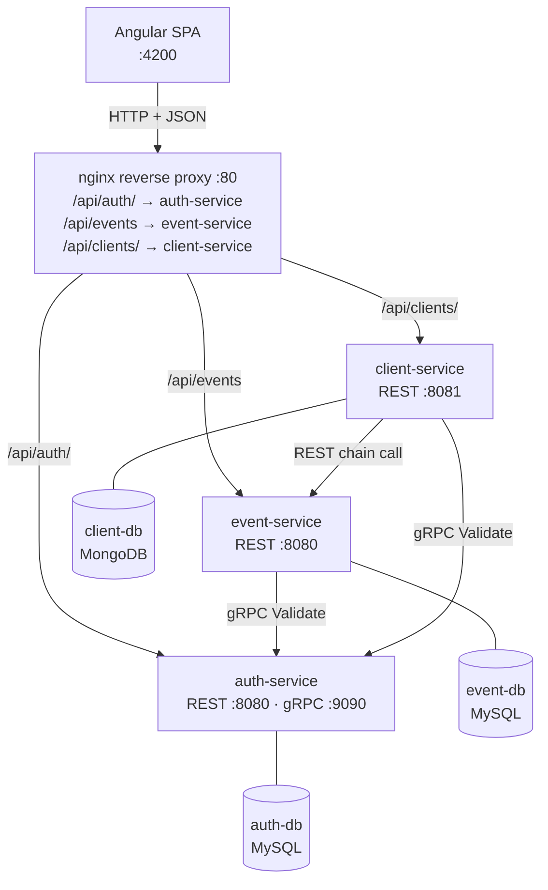
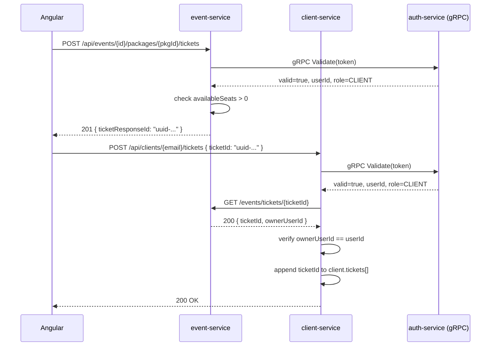
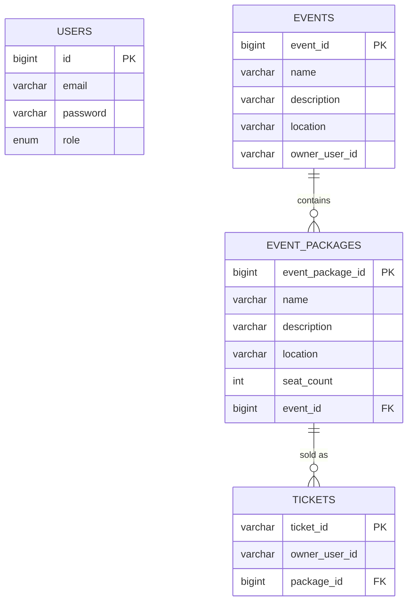

# Event Platform

A microservices-based platform for managing artistic events, ticket packages, and client bookings.

---

## Table of Contents

- [Core Functionality](#core-functionality)
- [Architecture](#architecture)
- [Ticket Purchase Flow](#ticket-purchase-flow)
- [Entity-Relationship Model](#entity-relationship-model)
- [Security Model](#security-model)
- [JWT Token Structure](#jwt-token-structure)
- [gRPC Contract](#grpc-contract)
- [REST API — Auth Service](#rest-api--auth-service)
- [REST API — Event Service](#rest-api--event-service)
- [REST API — Client Service](#rest-api--client-service)
- [Key Design Decisions](#key-design-decisions)
- [Database Schemas](#database-schemas)
- [Project Structure](#project-structure)
- [Environment Variables](#environment-variables)
- [Running with Docker](#running-with-docker)
- [Local Development](#local-development)
- [Default Admin Account](#default-admin-account)

---

## Core Functionality

**Event Management**: Users with the `OWNER_EVENT` role create and manage artistic events. Each event has a name, optional location, and description. Owners can define multiple ticket packages per event, each with a fixed seat count. Only the event owner can modify or delete their own events and packages. Admins have unrestricted access.

**Ticket Sales**: Clients browse public event and package listings and purchase tickets for any package with available seats. The system tracks sold tickets in real time and blocks purchases when a package reaches capacity. Each ticket is identified by a UUID generated at purchase time.

**Client Profiles**: Clients maintain a personal profile stored in MongoDB with optional public information and social media links. After purchasing a ticket, the Angular frontend registers the ticket UUID in the client's profile through the client-service. The client-service validates ticket existence by querying the event-service before persisting the UUID.

**Account Administration**: A dedicated `ADMIN` role creates user accounts and assigns roles. Admins do not interact with event or client data.

---

## Architecture



### Services

| Service | Role | Stack | Port |
|---------|------|-------|------|
| auth-service | Identity management — JWT issuance, validation, blacklist | Spring Boot, MySQL, gRPC | REST :8080, gRPC :9090 |
| event-service | Events, packages, tickets | Spring Boot, MySQL, Spring HATEOAS | REST :8080 |
| client-service | Client profiles and ticket history | Spring Boot, MongoDB | REST :8081 |
| frontend | Single Page Application | Angular 22, nginx | :80 (→ host :4200) |

### nginx Proxy Rules

| Location prefix | Proxied to | Notes |
|-----------------|-----------|-------|
| `/api/auth/` | `http://auth-service:8080/auth/` | Trailing slash preserved |
| `/api/events` | `http://event-service:8080/events` | Prefix match, no trailing slash |
| `/api/clients/` | `http://client-service:8081/clients/` | Trailing slash preserved |

The `GET /events/tickets/{ticketId}` endpoint used by client-service for chain validation is **not** proxied by nginx — it is reachable only within the Docker network.

---

## Ticket Purchase Flow



The chain call from client-service to event-service ensures the ticket UUID exists on the event-service before it is stored in MongoDB, preventing stale or fabricated UUIDs from entering the client profile.

---

## Entity-Relationship Model



`owner_user_id` in `EVENTS` and `TICKETS` stores the JWT `sub` claim as a plain string — there is no foreign key to `USERS`. The services run on separate databases and do not share a schema.

---

## Security Model

### Roles and Permissions

| Role | Capabilities |
|------|-------------|
| `ADMIN` | Create user accounts with any role |
| `OWNER_EVENT` | Full CRUD on own events and packages; read-only on all events |
| `CLIENT` | Purchase tickets; view events and packages; manage own profile |

### Authorization Flow

```
HTTP Request + Authorization: Bearer <token>
         │
         ▼
Extract token from Authorization header
         │
         ▼
gRPC Validate(token) → auth-service
         │
         ├── valid=false → 401 Unauthorized
         │
         └── valid=true → { userId, role }
                  │
                  ├── role insufficient → 403 Forbidden
                  │
                  └── authorized → process request
```

Read endpoints for events and packages (`GET /events`, `GET /events/{id}`, `GET /events/{id}/packages`, `GET /events/{id}/packages/{packageId}`) are **public** — no token required.

---

## JWT Token Structure

Tokens follow the **JWS** standard (RFC 7515/7519): `base64url(header).base64url(payload).signature`

### Header
```json
{ "alg": "HS256", "typ": "JWT" }
```

### Payload (Claims)

| Claim | Type | Description |
|-------|------|-------------|
| `sub` | string | User ID — numeric ID stored as string |
| `role` | string | `ADMIN`, `OWNER_EVENT`, or `CLIENT` |
| `iat` | number | Issued-at timestamp |
| `exp` | number | Expiration timestamp (default: 24 h) |

### Signature

```
HMAC-SHA256(base64url(header) + "." + base64url(payload), secretKey)
```

The secret key is configured via `JWT_SECRET` as a 64-character hex string (256-bit).

### Token Blacklist

On logout, the raw token string is added to an in-memory `ConcurrentHashSet` in auth-service. Every `Validate` gRPC call checks the blacklist before verifying the signature. Blacklisted tokens remain invalid until auth-service restarts.

---

## gRPC Contract

Defined in `auth.proto` — identical copy in all services under `src/main/proto/`.

```protobuf
syntax = "proto3";
package auth;

option java_package = "com.example.auth.grpc";

service AuthService {
  rpc Validate (ValidateRequest) returns (ValidateResponse);
  rpc Logout   (LogoutRequest)   returns (LogoutResponse);
}

message ValidateRequest  { string token   = 1; }
message ValidateResponse { bool valid     = 1; string user_id = 2; string role = 3; }

message LogoutRequest  { string token   = 1; }
message LogoutResponse { bool   success = 1; }
```

All RPCs use the **Unary RPC** pattern. event-service and client-service connect to auth-service via `ManagedChannelBuilder.forAddress(AUTH_GRPC_HOST, AUTH_GRPC_PORT).usePlaintext()`.

---

## REST API — Auth Service

Base path: `/auth` · External: `/api/auth/` · Port: `8080` (internal), `8090` (host debug)

| Method | Path | Auth | Status | Description |
|--------|------|------|--------|-------------|
| `POST` | `/auth/login` | Public | 200, 401 | Authenticate, receive JWT |
| `POST` | `/auth/logout` | Bearer | 200 | Invalidate token (add to blacklist) |
| `POST` | `/auth/users` | ADMIN | 201, 403, 409 | Create new user account |

### POST `/auth/login`

```json
// Request
{ "email": "owner@platform.com", "password": "secret123" }

// 200
{ "token": "eyJhbGciOiJIUzI1NiJ9..." }

// 401
{ "error": "Credentiale invalide" }
```

### POST `/auth/logout`

```
Authorization: Bearer <token>
```

```json
// 200
{ "success": true }
```

### POST `/auth/users`

```json
// Request (ADMIN token required)
{ "email": "client@platform.com", "password": "pass123", "role": "CLIENT" }

// 201
{ "message": "User creat cu succes" }

// 409
{ "error": "Email deja existent" }
```

Valid roles: `ADMIN`, `OWNER_EVENT`, `CLIENT`

---

## REST API — Event Service

Base path: `/events` · External: `/api/events` · Port: `8080`

All responses include HATEOAS `_links`. `GET` endpoints are public. Write endpoints require `Authorization: Bearer <token>`.

### Events

| Method | Path | Auth | Status | Description |
|--------|------|------|--------|-------------|
| `GET` | `/events` | Public | 200 | List events (paginated, filterable) |
| `GET` | `/events/{id}` | Public | 200, 404 | Get event by ID |
| `POST` | `/events` | OWNER_EVENT or ADMIN | 201, 401, 403 | Create event |
| `PUT` | `/events/{id}` | OWNER_EVENT (own) or ADMIN | 200, 401, 403, 404 | Replace event |
| `DELETE` | `/events/{id}` | OWNER_EVENT (own) or ADMIN | 204, 401, 403, 404 | Delete event and all its packages and tickets |

#### Query parameters — `GET /events`

| Parameter | Type | Default | Description |
|-----------|------|---------|-------------|
| `name` | string | — | Partial, case-insensitive name filter |
| `page` | int | `0` | Page index (0-based) |
| `size` | int | `10` | Items per page |

Results are sorted alphabetically by name.

#### Event body (`POST`, `PUT`)

```json
{ "name": "Concert Iași", "location": "Sala Palatului", "description": "Un concert extraordinar" }
```

`name` is required. `location` and `description` are optional.

#### Event response

```json
{
  "eventResponseId": 1,
  "name": "Concert Iași",
  "location": "Sala Palatului",
  "description": "Un concert extraordinar",
  "_links": {
    "self":     { "href": "/events/1" },
    "packages": { "href": "/events/1/packages" }
  }
}
```

`ownerUserId` is stored server-side and never exposed in responses.

---

### Packages

| Method | Path | Auth | Status | Description |
|--------|------|------|--------|-------------|
| `GET` | `/events/{eventId}/packages` | Public | 200, 404 | List packages for an event |
| `GET` | `/events/{eventId}/packages/{packageId}` | Public | 200, 404 | Get package by ID |
| `POST` | `/events/{eventId}/packages` | OWNER_EVENT (own event) or ADMIN | 201, 401, 403, 404 | Create package |
| `PUT` | `/events/{eventId}/packages/{packageId}` | OWNER_EVENT (own event) or ADMIN | 200, 401, 403, 404 | Replace package |
| `DELETE` | `/events/{eventId}/packages/{packageId}` | OWNER_EVENT (own event) or ADMIN | 204, 401, 403, 404 | Delete package and all its tickets |

#### Package body (`POST`, `PUT`)

```json
{ "name": "VIP", "location": "Zona A", "description": "Acces VIP", "seatCount": 50 }
```

`name` and `seatCount` are required (`seatCount` ≥ 1). `location` and `description` are optional.

#### Package response

```json
{
  "packageResponseId": 3,
  "name": "VIP",
  "location": "Zona A",
  "description": "Acces VIP",
  "seatCount": 50,
  "availableSeats": 47,
  "_links": {
    "self":    { "href": "/events/1/packages/3" },
    "event":   { "href": "/events/1" },
    "tickets": { "href": "/events/1/packages/3/tickets" }
  }
}
```

`availableSeats` is computed dynamically as `seatCount − COUNT(tickets)`.

---

### Tickets

| Method | Path | Auth | Status | Description |
|--------|------|------|--------|-------------|
| `GET` | `/events/{eventId}/packages/{packageId}/tickets` | OWNER_EVENT (own) or ADMIN | 200, 401, 403, 404 | List all tickets for a package |
| `POST` | `/events/{eventId}/packages/{packageId}/tickets` | CLIENT | 201, 401, 403, 404, 409 | Purchase a ticket |
| `GET` | `/events/{eventId}/packages/{packageId}/tickets/{ticketId}` | CLIENT (own), OWNER_EVENT (own), or ADMIN | 200, 401, 403, 404 | Get ticket by ID |
| `GET` | `/events/tickets/{ticketId}` | Internal (service-to-service) | 200, 404 | Verify ticket existence — used by client-service chain call only; not proxied by nginx |

#### Ticket response

```json
{
  "ticketResponseId": "f47ac10b-58cc-4372-a567-0e02b2c3d479",
  "ownerUserId": "42",
  "_links": {
    "self":    { "href": "/events/1/packages/3/tickets/f47ac10b-58cc-4372-a567-0e02b2c3d479" },
    "package": { "href": "/events/1/packages/3" }
  }
}
```

`409 Conflict` is returned when all seats are sold. A CLIENT can view only their own ticket; an OWNER_EVENT can view any ticket for packages on their own event.

---

### Error responses

```json
{ "error": "<mesaj>" }
```

| Status | Condition |
|--------|-----------|
| `401` | Missing, invalid, expired, or blacklisted token |
| `403` | Valid token but insufficient role or not the owner |
| `404` | Resource not found |
| `409` | Conflict — no seats available |

---

## REST API — Client Service

Base path: `/clients` · External: `/api/clients/` · Port: `8081`

All endpoints require `Authorization: Bearer <token>`.

### Client Profile

| Method | Path | Auth | Status | Description |
|--------|------|------|--------|-------------|
| `POST` | `/clients/` | CLIENT | 201, 401, 409 | Create profile — email from request body must match the authenticated user |
| `GET` | `/clients/{email}` | CLIENT (own) or OWNER_EVENT | 200, 401, 403, 404 | Get profile — CLIENT sees all fields; OWNER_EVENT sees only public fields |
| `PATCH` | `/clients/{email}` | CLIENT (own) | 200, 401, 403, 404 | Partial update — only provided fields are changed |
| `DELETE` | `/clients/{email}` | CLIENT (own) | 204, 401, 403, 404 | Delete profile |

#### GET `/clients/{email}` — response (CLIENT)

```json
{
  "email": "client@example.com",
  "firstName": "Ion",
  "lastName": "Popescu",
  "publicInfo": true,
  "socialMedia": {
    "linkedin": "https://linkedin.com/in/ion",
    "publicSocialMedia": false
  },
  "tickets": ["f47ac10b-58cc-4372-a567-0e02b2c3d479"]
}
```

`OWNER_EVENT` receives only the fields where `publicInfo = true`, and `socialMedia` only when `publicSocialMedia = true`.

### Tickets

| Method | Path | Auth | Status | Description |
|--------|------|------|--------|-------------|
| `GET` | `/clients/{email}/tickets` | CLIENT (own) | 200, 401, 403, 404 | List registered ticket UUIDs |
| `POST` | `/clients/{email}/tickets` | CLIENT (own) | 200, 401, 403, 404 | Register a ticket UUID — triggers chain call to event-service |

#### POST `/clients/{email}/tickets`

```json
// Request
{ "ticketId": "f47ac10b-58cc-4372-a567-0e02b2c3d479" }

// 200 — returns updated ticket list
["f47ac10b-58cc-4372-a567-0e02b2c3d479", "..."]

// 403 — ticket not found or does not belong to the caller
{ "error": "Biletul nu a fost gasit sau nu va apartine" }
```

The chain call to `GET /events/tickets/{ticketId}` is made synchronously before persisting the UUID. If the event-service returns 404, the client-service returns 404 to the caller. If `ownerUserId` in the event-service response does not match the authenticated user's ID, the client-service returns 403.

---

## Key Design Decisions

**No cross-database foreign keys**: `owner_user_id` in `events` and `tickets` stores the JWT `sub` as a plain string. The auth-service, event-service, and client-service each have their own isolated database. Referential integrity between services is enforced by application logic (ownership checks), not by database constraints.

**JWT claims over session state**: Every protected request carries all necessary identity information (`userId`, `role`) inside the JWT. Services do not maintain sessions — the token is the only source of truth per request. This makes all backend services stateless and independently scalable.

**gRPC for token validation**: event-service and client-service validate tokens via gRPC instead of REST to reduce per-request overhead (HTTP/2 multiplexing, binary Protobuf encoding, persistent connection).

**Chain call for ticket registration**: After purchasing a ticket from event-service, the Angular client calls client-service to register the UUID. client-service performs a chain call to `GET /events/tickets/{ticketId}` to confirm the ticket exists and belongs to the caller before persisting it to MongoDB. This prevents stale or fabricated ticket UUIDs in client profiles.

**HATEOAS on event-service responses**: All event, package, and ticket responses include `_links`. This allows the frontend to discover related resources (e.g., navigate from an event to its packages list) without hard-coding URL structures.

**In-memory token blacklist**: The blacklist is a `ConcurrentHashSet` in auth-service heap. It provides immediate logout invalidation without a database round-trip, at the cost of being cleared on service restart. A persistent blacklist (e.g., Redis with TTL) would survive restarts but adds infrastructure complexity; the current tradeoff is acceptable for a single-node deployment.

**`availableSeats` computed at query time**: Available seat count is never stored — it is calculated as `seatCount − COUNT(tickets)` per request. This avoids double-update consistency issues (updating both a counter and inserting a row) at the cost of a count query per package read.

**Cascade delete via JPA**: Deleting an event cascades to its packages; deleting a package cascades to its tickets. The cascade is configured at the JPA level (`CascadeType.ALL`, `orphanRemoval = true`), not at the database constraint level.

---

## Database Schemas

### Auth Service — MySQL

**`users`**

| Column | Type | Constraints |
|--------|------|-------------|
| `id` | BIGINT | PK, AUTO_INCREMENT |
| `email` | VARCHAR | UNIQUE, NOT NULL |
| `password` | VARCHAR | NOT NULL — BCrypt hashed |
| `role` | ENUM(`ADMIN`,`OWNER_EVENT`,`CLIENT`) | NOT NULL |

---

### Event Service — MySQL

**`events`**

| Column | Type | Constraints |
|--------|------|-------------|
| `event_id` | BIGINT | PK, AUTO_INCREMENT |
| `name` | VARCHAR | NOT NULL |
| `description` | VARCHAR | NULLABLE |
| `location` | VARCHAR | NULLABLE |
| `owner_user_id` | VARCHAR | NOT NULL — no FK to users |

**`event_packages`**

| Column | Type | Constraints |
|--------|------|-------------|
| `event_package_id` | BIGINT | PK, AUTO_INCREMENT |
| `name` | VARCHAR | NOT NULL |
| `description` | VARCHAR | NULLABLE |
| `location` | VARCHAR | NULLABLE |
| `seat_count` | INT | NOT NULL, ≥ 1 |
| `event_id` | BIGINT | FK → events.event_id, NOT NULL |

**`tickets`**

| Column | Type | Constraints |
|--------|------|-------------|
| `ticket_id` | VARCHAR | PK — UUID generated at purchase |
| `owner_user_id` | VARCHAR | NOT NULL — no FK to users |
| `package_id` | BIGINT | FK → event_packages.event_package_id, NOT NULL |

---

### Client Service — MongoDB

**`clients` collection**

```json
{
  "_id": "ObjectId",
  "email": "client@example.com",
  "userId": "42",
  "firstName": "Ion",
  "lastName": "Popescu",
  "publicInfo": true,
  "socialMedia": {
    "linkedin": "https://linkedin.com/in/...",
    "publicSocialMedia": false
  },
  "tickets": [
    "f47ac10b-58cc-4372-a567-0e02b2c3d479"
  ]
}
```

`email` carries a unique index (`@Indexed(unique=true)`). `userId` is the JWT `sub` claim stored at profile creation — it ties the MongoDB document to the auth-service user without a cross-database foreign key. `tickets` stores UUID strings matching `ticket_id` from the event-service. `publicInfo` controls profile visibility to `OWNER_EVENT` users. `firstName`, `lastName`, and `socialMedia` are optional.

---

## Project Structure

```
event-platform/
├── auth-service/
│   ├── src/main/java/com/example/event_service/
│   │   ├── controller/       AuthController.java
│   │   ├── grpc/             AuthGrpcService.java
│   │   ├── model/            User.java
│   │   ├── repository/       UserRepository.java
│   │   ├── service/          AuthService.java · JwtService.java · TokenBlacklistService.java
│   │   └── config/           DataSeeder.java · SecurityConfig.java
│   └── src/main/proto/       auth.proto
│
├── event-service/
│   ├── src/main/java/com/example/event_service/
│   │   ├── controller/       EventController.java · PackageController.java
│   │   │                     TicketController.java · TicketLookupController.java
│   │   ├── dto/              CreateEventRequest.java · EventResponse.java
│   │   │                     CreatePackageRequest.java · PackageResponse.java · TicketResponse.java
│   │   ├── exception/        GlobalExceptionHandler.java · NotFoundException.java
│   │   │                     ForbiddenException.java · UnauthorizedException.java
│   │   ├── grpc/             TokenValidationService.java
│   │   ├── model/            Event.java · EventPackage.java · Ticket.java
│   │   ├── repository/       EventRepository.java · EventPackageRepository.java · TicketRepository.java
│   │   └── service/          EventService.java · PackageService.java · TicketService.java
│   └── src/main/proto/       auth.proto
│
├── client-service/
│   ├── src/main/java/com/example/client_service/
│   │   ├── controller/       ClientController.java
│   │   ├── dto/              CreateClientRequest.java · UpdateClientRequest.java
│   │   │                     AddTicketRequest.java · ClientResponse.java
│   │   ├── exception/        GlobalExceptionHandler.java · NotFoundException.java
│   │   │                     ForbiddenException.java · UnauthorizedException.java
│   │   ├── grpc/             AuthGrpcClient.java
│   │   ├── model/            Client.java
│   │   ├── repository/       ClientRepository.java
│   │   └── service/          TokenValidationService.java · ClientService.java
│   │                         ClientTicketService.java · EventVerificationService.java
│   └── src/main/proto/       auth.proto
│
├── frontend/
│   └── src/app/
│       ├── core/
│       │   ├── guards/       auth.guard.ts · role.guard.ts
│       │   ├── interceptors/ auth.interceptor.ts
│       │   ├── models/       user.model.ts · event.model.ts · client.model.ts
│       │   └── services/     auth.service.ts · event.service.ts · client.service.ts
│       └── features/
│           ├── auth/         login/
│           ├── events/       event-list/ · event-detail/ · create-event/ · edit-event/
│           ├── admin/        create-user/
│           └── profile/      profile.component (ts · html · scss)
│
├── nginx/
│   └── nginx.conf
├── docker-compose.yml
└── .env.example
```

---

## Environment Variables

Copy `.env.example` to `.env`:

```bash
cp .env.example .env
```

| Variable | Default | Description |
|----------|---------|-------------|
| `AUTH_DB_NAME` | `auth_db` | Auth service MySQL database |
| `AUTH_DB_USER` | `auth_user` | Auth service DB username |
| `AUTH_DB_PASSWORD` | — | Auth service DB password |
| `AUTH_DB_ROOT_PASSWORD` | — | MySQL root password |
| `AUTH_DB_PORT` | `3306` | Host port for auth-db |
| `EVENT_DB_NAME` | `event_db` | Event service MySQL database |
| `EVENT_DB_USER` | `event_user` | Event service DB username |
| `EVENT_DB_PASSWORD` | — | Event service DB password |
| `EVENT_DB_ROOT_PASSWORD` | — | MySQL root password |
| `EVENT_DB_PORT` | `3307` | Host port for event-db |
| `CLIENT_DB_NAME` | `client_db` | Client service MongoDB database |
| `CLIENT_DB_USER` | `client_user` | MongoDB username |
| `CLIENT_DB_PASSWORD` | — | MongoDB password |
| `CLIENT_DB_PORT` | `27017` | Host port for client-db |
| `JWT_SECRET` | — | 64-character hex string (256-bit HS256 key) |
| `JWT_EXPIRATION_MS` | `86400000` | Token validity in ms (default 24 h) |

---

## Running with Docker

### Start all services

```bash
docker compose up --build
```

### Rebuild a single service after code changes

```bash
docker compose build <service-name>
docker compose up -d <service-name>
```

Example after changing event-service and frontend:

```bash
docker compose build event-service frontend
docker compose up -d event-service frontend
```

### Full cache clear (when stale layers cause issues)

```bash
docker system prune -a --volumes -f
docker compose up --build
```

### Stop containers

```bash
docker compose down          # keep volumes
docker compose down -v       # wipe all data volumes
```

### Service URLs

| Service | URL | Notes |
|---------|-----|-------|
| Frontend | `http://localhost:4200` | Served by nginx |
| Auth REST | `http://localhost:8090` | Direct — debug only |
| Event REST | `http://localhost:8080` | Direct — debug only |
| Client REST | `http://localhost:8081` | Direct — debug only |
| Auth gRPC | `localhost:9090` | Container-internal only |
| Auth DB | `localhost:3306` | MySQL |
| Event DB | `localhost:3307` | MySQL |
| Client DB | `localhost:27017` | MongoDB |

---

## Local Development

| Tool | Version |
|------|---------|
| Java | 25 |
| Maven | 3.9+ |
| Node.js | 20+ LTS |
| Angular CLI | latest |
| Docker Desktop | latest |

```bash
# 1. Start databases
docker compose up auth-db event-db client-db -d

# 2. Run auth-service  (REST :8080, gRPC :9090)
cd auth-service && mvn spring-boot:run

# 3. Run event-service  (REST :8080)
cd event-service && mvn spring-boot:run

# 4. Run client-service  (REST :8081)
cd client-service && mvn spring-boot:run

# 5. Run frontend  (http://localhost:4200)
cd frontend && npm install && ng serve
```

In development, configure Angular's `proxy.conf.json` to forward `/api/*` to the appropriate backend ports.

---

## Default Admin Account

Created automatically on first startup by `DataSeeder`:

| Field | Value |
|-------|-------|
| Email | `admin@platform.com` |
| Password | `admin123` |
| Role | `ADMIN` |

> Change the default credentials before any production or shared deployment.
